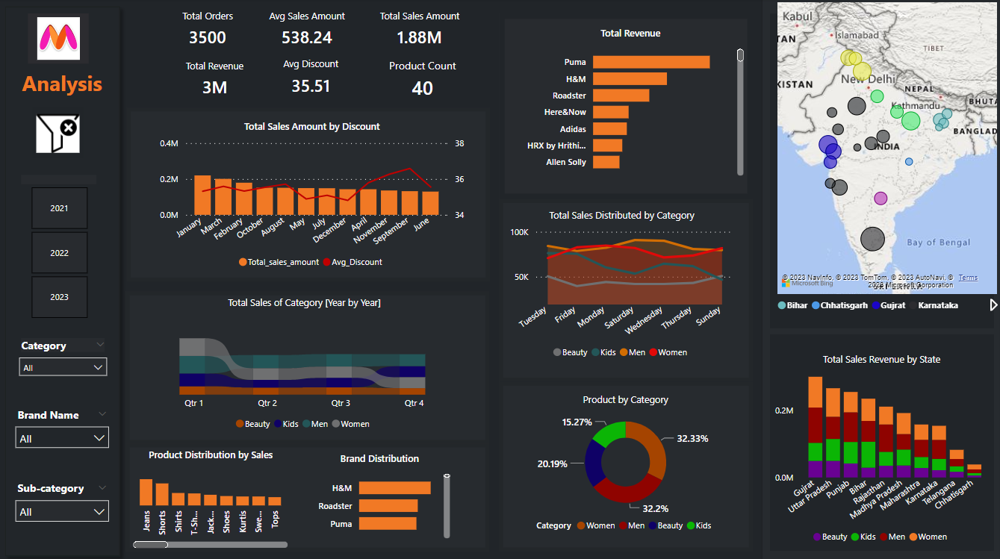

# 🛍️ Myntra Annual Sales Data Visualization Project

## 📊 Overview
The **Myntra Sales Data Visualization Project** leverages **Microsoft Power BI** to transform raw e-commerce data into strategic business insights.  
It provides a comprehensive analysis of Myntra’s yearly performance by integrating **sales, product, and customer datasets** using a **star schema data model**.  
The dashboard helps identify key revenue drivers, optimize pricing and discount strategies, and support **data-driven decision-making** for improved profitability and growth.

---

## 🎯 Business Objective
To achieve sustainable revenue growth and profitability by optimizing product portfolio, pricing, and discount strategies.  
The project aims to improve operational efficiency, increase market penetration, and enhance customer satisfaction through strategic insights into sales, consumer behavior, and brand competitiveness.

---

## 🧩 Problem Statement
The project focuses on understanding market and category performance, identifying key revenue drivers, optimizing pricing and discount strategies, and supporting data-driven business decisions for increased profitability and growth.

---

## 🗂️ Data Exploration

The dataset was sourced from an Excel workbook containing **three worksheets**:

### 1️⃣ dim_products
| Column Name | Description |
|--------------|-------------|
| Product_ID | Unique ID for each product |
| Category | Product category (Men, Women, Kids, Beauty) |
| Sub_Category | Specific sub-category (Jeans, Tops, Shoes, etc.) |
| Product_Name | Name of the product |
| Brand_Name | Brand of the product |
| Size | Product size (S, M, L, XL) |
| Colour | Product color |
| Ratings | Customer rating for the product |

### 2️⃣ dim_customers
| Column Name | Description |
|--------------|-------------|
| Customer_ID | Unique ID for each customer |
| Customer_Age | Age of the customer |
| City | Customer’s city |
| State | Customer’s state |

### 3️⃣ fact_orders
| Column Name | Description |
|--------------|-------------|
| Order_ID | Unique identifier for each order |
| Customer_ID | Foreign key linking to dim_customers |
| Product_ID | Foreign key linking to dim_products |
| Date | Order date |
| Original_Price | Listed price before discount |
| Discount | Discount applied on product |
| Final_Price | Price after discount |

---

## ⚙️ Solution Approach

**Key DAX Measures Created:**

| Measure Name | Formula (DAX) | Description |
|---------------|----------------|--------------|
| Total Orders | `DISTINCTCOUNT(fact_orders[Order_ID])` | Total orders placed |
| Total Sales Amount | `SUM(fact_orders[Sales_Amount])` | Total sales generated after discount |
| Total Revenue | `SUMX(fact_orders, fact_orders[Original_Price] * (1 - fact_orders[Discount]/100))` | Calculates total revenue |
| Average Sales Amount | `AVERAGE(fact_orders[Sales_Amount])` | Mean sales amount per order |
| Average Discount | `AVERAGE(fact_orders[Discount])` | Average discount percentage |
| Product Count | `DISTINCTCOUNT(dim_products[Product_ID])` | Number of unique products |
| Average Ratings | `AVERAGE(dim_products[Ratings])` | Overall average rating |

---

## 🧱 Data Modelling
The data was modeled using a **Star Schema**, connecting:
- **fact_orders** as the fact table  
- **dim_products** and **dim_customers** as dimension tables

This structure supports efficient filtering, aggregation, and visualization in Power BI.

---

## 📈 Dashboard Preview

---

## 🖼️ Key Features

### ✅ KPIs
- **Total Orders:** 3,500  
- **Average Sales Amount:** 538.24  
- **Total Sales Amount:** 1.88M  
- **Total Revenue:** 3M  
- **Average Discount:** 35.51%  
- **Product Count:** 40  

### ✅ Interactive Visualizations

#### 🧭 Sales Revenue by State (Map View)
A geographical visualization displaying state-wise sales performance, highlighting high-revenue regions such as Gujarat, Uttar Pradesh, and Punjab.  

---

#### 📊 Sales vs. Discount Analysis
Analyzes the relationship between sales volume and discount percentages to determine optimal discounting strategies that maximize profit.  

---

#### 👗 Category Performance by Year
Shows year-over-year performance of key categories — highlighting consistent growth in the women’s segment and seasonal spikes in Q4 sales.  

---

#### 📦 Product Distribution by Sales
Displays top-performing products (jeans, shirts, and t-shirts) across demographics, identifying high-demand product lines for better inventory planning.  

#### 💰 Revenue by Brand
Ranks brands by total sales and profitability, emphasizing the dominance of Puma, H&M, and Roadster.  

#### 🧍 Sales by Category and Geography
Combines product category and region data to uncover trends in customer preferences and regional buying patterns.  

#### 🥧 Category Distribution (Pie Chart)
Visual breakdown of sales contribution by major categories such as Men, Women, and Kids, illustrating customer engagement distribution.

### ✅ Interactive Slicers
- Category  
- Brand Name  
- Sub-Category  
- Year (2021, 2022, 2023)

---

## 🚀 Business Outcomes

1. **Top Brands:** Puma, H&M, and Roadster lead in revenue due to high demand and effective cross-segment marketing.  
2. **Top Categories:** Women’s products contribute ~32% of total sales, showcasing strong customer engagement.  
3. **Best Products:** Jeans, shirts, and t-shirts dominate across demographics.  
4. **Discount Impact:** Moderate discounts (30–40%) maximize conversions and profitability.  
5. **Geographic Insights:** Gujarat, Uttar Pradesh, and Punjab are the top revenue-generating states.  
6. **Category Trends:** Women’s category shows consistent year-over-year growth.  
7. **Seasonal Trends:** Q4 remains the most profitable quarter, driven by festive sales.

---

## 🧭 Conclusion
The Power BI dashboard delivers a holistic view of Myntra’s annual performance, identifying opportunities for market expansion, pricing optimization, and targeted marketing.  
By leveraging these insights, the company can enhance customer satisfaction, optimize inventory, and achieve sustainable growth in the competitive e-commerce space.

---

## 🔮 Future Scope
- Integrate **real-time data refresh** for up-to-date monitoring  
- Develop a **mobile-optimized dashboard** version for enhanced accessibility  
- Include **predictive analytics** to forecast future sales trends

---

## 🧰 Tools and Technologies
- **Microsoft Power BI**  
- **Microsoft Excel**  
- **DAX (Data Analysis Expressions)**  
- **Power Query**  

---

## 📁 Project Files
| File | Description |
|------|--------------|
| [Myntra Anual Dashboard.pbix](Myntra%20Anual%20Dashboard.pbix) | Power BI Project File |
| [Myntra Dataset.xlsx](Myntra%20dataset.xlsx) | Dataset used for the dashboard |
| [Dashboard.png](Dashboard.png) | Dashboard Screenshot |

---

## 👨‍💻 Developer
**Name:** [Your Name]  
**Role:** Data Analyst | Business Intelligence Enthusiast  
**Tools Used:** Power BI, Excel, DAX, Power Query  
**Date:** August 2024  

---
